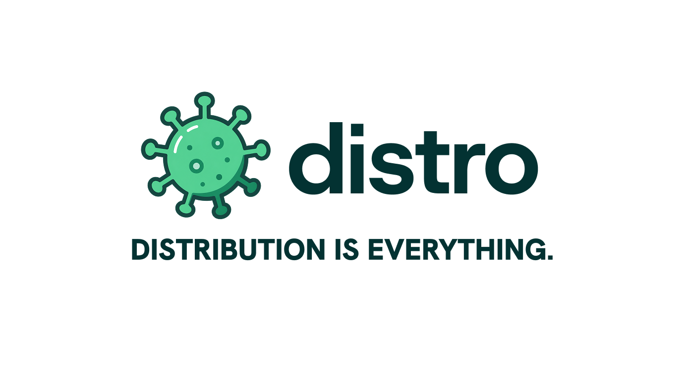

<div align="center">
  
</div>

<h3 align="center">The onchain clipping marketplace.</h3>

<p align="center">
  Brands fund USDC reward pools. Clippers cut content and post it. Every verified
  view pays out from the pool automatically — no invoices, no chasing.
</p>

<p align="center">
  
  
  
  
  
</p>

---

## How it works

1. **Brands** fund a USDC reward pool on-chain (`DistroEscrow`) and upload source content to clip.
2. **Clippers** verify their socials (YouTube ownership via a bio code, World ID for one-person-one-account), then submit clips.
3. A **Chainlink CRE** operator records cumulative views on-chain each day; the escrow credits each clipper `Δviews × CPM`, capped by the remaining budget.
4. **Clippers claim** their owed USDC straight from the escrow — pull payments, so one bad recipient can never block a batch.

Settlement is native USDC on **Arc testnet** (chainId `5042002`).

## Monorepo

| Package | Stack | What it does |
| --- | --- | --- |
| [`app/`](app) | Next.js 16 · React 19 · Tailwind v4 · Privy · wagmi/viem · React Query | Marketplace UI — browse/fund campaigns, connect socials, submit clips, claim payouts |
| [`api/`](api) | NestJS 10 · MongoDB · Privy · World ID · YouTube Data API · viem | Auth, accounts, campaigns, submissions, leaderboard, and the CRE payout batch |
| [`contracts/`](contracts) | Foundry · Solidity | `DistroEscrow` (jobs, CPM accrual, claims) + `EscrowViewsReporter` (CRE adapter) |
| [`cre/`](cre) | Chainlink Runtime Environment | Daily operator workflow that records views on-chain trustlessly |

## Quick start

Run the **API** (port `3001`) and the **web app** (port `3000`) side by side — the app proxies `/api/backend/*` to the API, so the browser stays same-origin.

```bash
# 1. API — NestJS + MongoDB
cd api
yarn install
cp .env.example .env        # MongoDB, Privy, World ID, YouTube, Arc RPC + escrow
yarn start:dev              # http://localhost:3001  (Swagger at /docs)

# 2. Web app — Next.js
cd app
npm install
npm run dev                 # http://localhost:3000
```

Smart contracts and the CRE operator have their own setup — see [`contracts/`](contracts/README.md) and [`cre/`](cre/README.md).

## Deployed on Arc testnet

| Contract | Address |
| --- | --- |
| `DistroEscrow` | [`0x85ea0a0843169f5BcfEafD295790179964cd5320`](https://testnet.arcscan.app/address/0x85ea0a0843169f5BcfEafD295790179964cd5320) |
| `EscrowViewsReporter` | [`0x716f3b0b885Cf0Edd1Be17E1DF62560acbCE212F`](https://testnet.arcscan.app/address/0x716f3b0b885Cf0Edd1Be17E1DF62560acbCE212F) |

<div align="center"><sub><b>Distribution is everything.</b></sub></div>
